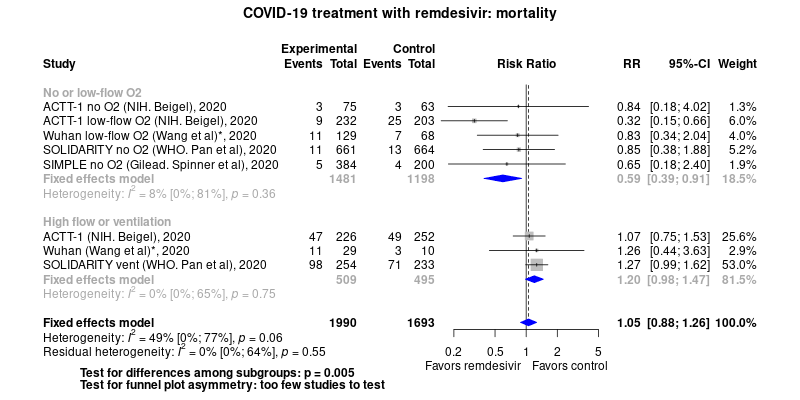

COVID-19 treatment with remdesivir
============================================
An expert-driven, 'really rapid' living systematic review

Short url: http://openmetaanalysis.github.io/covid-19/

**Clinical summary:** This meta-analysis suggests that clinical intervention *is not* effective. However, the heterogeneity of results as measured by I2 was '[substantial](http://handbook-5-1.cochrane.org/chapter_9/9_5_2_identifying_and_measuring_heterogeneity.htm)' at 74% before creating clinical subgroup. After subgroups are formed, the residenual heterogeneity is 22% and [might not be important'](http://handbook-5-1.cochrane.org/chapter_9/9_5_2_identifying_and_measuring_heterogeneity.htm)':
* Low risk group is significantly helped if  Hartung-Knapp analysis is not used
* Could not include the Solidarity arm that mixes low and hi-flow O2

An excellent clinical interpretation of this data is at
> Curtis MR, Sax P. Web Exclusive. Annals for Hospitalists Inpatient Notes - Remdesivir-Making Sense of Emerging Evidence. Ann Intern Med. 2020 Dec 15;173(12):HO2-HO3. doi: [10.7326/M20-7498](http://doi.org/10.7326/M20-7498). PMID: [33316192](http://pubmed.gov/33316192).

> Sax P. Does Remdesivir Actually Work? HIV and ID Observations [Internet]. 2020 Oct 18 [cited 2020 Oct 20]; Available from: https://blogs.jwatch.org/hiv-id-observations/index.php/does-remdesivir-actually-work/2020/10/18/

<!--
Meta-regression of common modulators (year of publication, study size, event rate in the control groups) finds that the outcome of the intervention is effected by xx.
* [Reconciliation of conclusions with prior meta-analyses](files/reconciliation-tables/Reconciliation%20of%20conclusions.pdf) (under construction)
* [Keep current with this topic](files/searching/Keep-up.md) (under construction)

-->
Acknowledgement: we acknowledge the essential work by the authors of the prior [systematic review(s)](#systematic-reviews) listed below.

**Methods overview:** This repository is an [openMetaAnalysis](https://openmetaanalysis.github.io/) expert-driven systematic review in which the choice of articles, metrics, and displays are entirely driven by group of one of more clinical experts. This analysis may update one or more previously published review(s) below. Newer studies included are listed in the references below. Rationale for newer trials excluded may be listed at the end of the references. 
<!--
* [Methods](http://openmetaanalysis.github.io/methods.html) for openMetaAnalysis
* [Evidence search](files/searching/evidence-search.md) for this review (under construction)
-->

**Results:** Details of the studies included are in the:
* [Reconciliation of trials included with prior meta-analyses/](files/reconciliation-tables/Reconciliation%20of%20studies.pdf) (under construction) 
<!--
* [Description of studies (PICO table)](files/study-details/table-pico.pdf) (under construction)
* [Risk of bias assessment](files/study-details/table-bias.pdf) (under construction)
* [Network plots](../master/files/network) (optional) 
-->
* [Forest plots](../master/files/forest-plots) ([source data](files/data)) 
* [Reconciliation of conclusions with prior meta-analyses](files/reconciliation-tables/Reconciliation%20of%20conclusions.pdf) (under construction)

The forest plot for the primary outcomes are below. Additional [forest plots](files/forest-plots) of secondary analyses may be available. 

\* The Wuhan data is from the meta-analysis in the Pan preprint DOI [10.1101/2020.10.15.20209817v1](http://doi.org/10.1101/2020.10.15.20209817v1). The numbers are attribted to the Wuhan author Bin Cao but do not quite match the Lancet final publication; however, the Lancet publication does not provide numbers for subgroups.
<!--
The meta-regression for the primary outcomes are below. Additional [meta-regressions](files/metaregression) of secondary analyses may be available. 
 (under construction)

The GRADE Profile is below.  (under construction)
-->
References:
----------------------------------

### Systematic review(s)
#### Most recent review at time of last revision of this repository
1. Update to living systematic review on drug treatments for covid-19. BMJ. 2020 Dec 17;371:m4852. doi: [10.1136/bmj.m4852](http://doi.org/10.1136/bmj.m4852). PMID: [33334735](http://pubmed.gov/33334735).
2. WHO Solidarity Trial Consortium, Pan H, Peto R, Karim QA, Alejandria M, Restrepo AMH, Garcia CH, Kieny MP, Malekzadeh R, Murthy S, Preziosi M-P, Reddy S, Roses M, Sathiyamoorthy V, Rottingen J-A, Swaminathan S. Repurposed antiviral drugs for COVID-19; interim WHO SOLIDARITY trial results. medRxiv [Internet]. Cold Spring Harbor Laboratory Press; 2020 Oct 15 [cited 2020 Oct 18];2020.10.15.20209817. DOI [10.1101/2020.10.15.20209817](http://doi.org/10.1101/2020.10.15.20209817); Available from: https://www.medrxiv.org/content/10.1101/2020.10.15.20209817v1 *This RCT includes a meta-analysis*
3. Juul S, Nielsen EE, Feinberg J, Siddiqui F, Jørgensen CK, Barot E, Nielsen N, Bentzer P, Veroniki AA, Thabane L, Bu F, Klingenberg S, Gluud C, Jakobsen JC. Interventions for treatment of COVID-19: A living systematic review with meta-analyses and trial sequential analyses (The LIVING Project). PLoS Med. 2020 Sep 17;17(9):e1003293. doi: [10.1371/journal.pmed.1003293](http://doi.org/10.1371/journal.pmed.1003293);. PMID: [32941437](http://pubmed.gov/32941437); PMCID: PMC7498193.

### Randomized controlled trials
#### New trial(s) *not* included in the most recent review above
1. Beigel JH, Tomashek KM, Dodd LE, Mehta AK, Zingman BS, Kalil AC, Hohmann E, Chu HY, Luetkemeyer A, Kline S, Lopez de Castilla D, Finberg RW, Dierberg K, Tapson V, Hsieh L, Patterson TF, Paredes R, Sweeney DA, Short WR, Touloumi G, Lye DC, Ohmagari N, Oh MD, Ruiz-Palacios GM, Benfield T, Fätkenheuer G, Kortepeter MG, Atmar RL, Creech CB, Lundgren J, Babiker AG, Pett S, Neaton JD, Burgess TH, Bonnett T, Green M, Makowski M, Osinusi A, Nayak S, Lane HC; ACTT-1 Study Group Members. Remdesivir for the Treatment of Covid-19 - Final Report. N Engl J Med. 2020 Oct 8:NEJMoa2007764. doi: [10.1056/NEJMoa2007764](http://doi.org/10.1056/NEJMoa2007764). Epub ahead of print. PMID: [32445440](http://pubmed.gov/32445440).
2. WHO Solidarity Trial Consortium, Pan H, Peto R, Karim QA, Alejandria M, Restrepo AMH, Garcia CH, Kieny MP, Malekzadeh R, Murthy S, Preziosi M-P, Reddy S, Roses M, Sathiyamoorthy V, Rottingen J-A, Swaminathan S. Repurposed antiviral drugs for COVID-19; interim WHO SOLIDARITY trial results. medRxiv [Internet]. Cold Spring Harbor Laboratory Press; 2020 Oct 15 [cited 2020 Oct 18];2020.10.15.20209817. DOI [10.1101/2020.10.15.20209817](http://doi.org/10.1101/2020.10.15.20209817); Available from: https://www.medrxiv.org/content/10.1101/2020.10.15.20209817v1 
3. WHO Solidarity Trial Consortium, Pan H, Peto R, Henao-Restrepo AM, Preziosi MP, Sathiyamoorthy V, et al. Repurposed Antiviral Drugs for Covid-19 - Interim WHO Solidarity Trial Results. N Engl J Med. 2020 Dec 2. doi: [10.1056/NEJMoa2023184](http://doi.org/10.1056/NEJMoa2023184). Epub ahead of print. PMID: [33264556](http://pubmed.gov/33264556).
4. Spinner CD, Gottlieb RL, Criner GJ, Arribas López JR, Cattelan AM, Soriano Viladomiu A, Ogbuagu O, Malhotra P, Mullane KM, Castagna A, Chai LYA, Roestenberg M, Tsang OTY, Bernasconi E, Le Turnier P, Chang SC, SenGupta D, Hyland RH, Osinusi AO, Cao H, Blair C, Wang H, Gaggar A, Brainard DM, McPhail MJ, Bhagani S, Ahn MY, Sanyal AJ, Huhn G, Marty FM; GS-US-540-5774 Investigators. Effect of Remdesivir vs Standard Care on Clinical Status at 11 Days in Patients With Moderate COVID-19: A Randomized Clinical Trial. JAMA. 2020 Sep 15;324(11):1048-1057. doi: [10.1001/jama.2020.16349](http://doi.org/10.1001/jama.2020.16349). PMID: [32821939](http://pubmed.gov/32821939). *Could not exclude 4 high risk patients*
5. Wang Y, Zhang D, Du G, Du R, Zhao J, Jin Y, Fu S, Gao L, Cheng Z, Lu Q, Hu Y, Luo G, Wang K, Lu Y, Li H, Wang S, Ruan S, Yang C, Mei C, Wang Y, Ding D, Wu F, Tang X, Ye X, Ye Y, Liu B, Yang J, Yin W, Wang A, Fan G, Zhou F, Liu Z, Gu X, Xu J, Shang L, Zhang Y, Cao L, Guo T, Wan Y, Qin H, Jiang Y, Jaki T, Hayden FG, Horby PW, Cao B, Wang C. Remdesivir in adults with severe COVID-19: a randomised, double-blind, placebo-controlled, multicentre trial. Lancet. 2020 May 16;395(10236):1569-1578. doi: [10.1016/S0140-6736(20)31022-9](http://doi.org/10.1016/S0140-6736(20)31022-9). Epub 2020 Apr 29. Erratum in: Lancet. 2020 May 30;395(10238):1694. PMID: [32423584](http://pubmed.gov/32423584).

#### Trial(s) included in the review above
None

#### Trial(s) undergoing review
None

#### Trial(s) excluded - selected list of important trial(s)
1. Goldman JD, Lye DCB, Hui DS, Marks KM, Bruno R, Montejano R, Spinner CD, Galli M, Ahn MY, Nahass RG, Chen YS, SenGupta D, Hyland RH, Osinusi AO, Cao H, Blair C, Wei X, Gaggar A, Brainard DM, Towner WJ, Muñoz J, Mullane KM, Marty FM, Tashima KT, Diaz G, Subramanian A; GS-US-540-5773 Investigators. Remdesivir for 5 or 10 Days in Patients with Severe Covid-19. N Engl J Med. 2020 May 27:NEJMoa2015301. doi: 10.1056/NEJMoa2015301. Epub ahead of print. PMID: [32459919](http://pubmed.gov/32459919) *No control group*

#### Cited by
This repository is cited by:

1. WikiDoc contributors. Pending content page. WikiDoc. Nov 9, 2014. Available at: http://www.wikidoc.org/index.php/This_topic. Accessed November 9, 2014. 

-------------------------------
[Cite and use this content](https://github.com/openMetaAnalysis/openMetaAnalysis.github.io/blob/master/reusing.MD)  - [Edit this page](../../edit/master/README.md) - [License](files/LICENSE.md) - [History](../../commits/master/README.md)  - 
[Issues and comments](../../issues?q=is%3Aboth+is%3Aissue)

